# Stick it to em'
## Introduction:
We wanted to creat an app where the user is able to interactively plan events as well as meetups together
in the form of sticky notes. The user can then invite others and find similar events that fit their interest. A safe place where everyone can be friends and hangout!

A demo for this app that you can view on this link:
 [Stick it to em'](https://boiling-garden-97737.herokuapp.com/)

 
 

## Technologies used:
* HTML
* CSS
* JS
* Macromedia Fireworks
* mySql
* Heroku
* Handlebars
* JQuery
* Notifications API
 
 

### Original CSS  Code
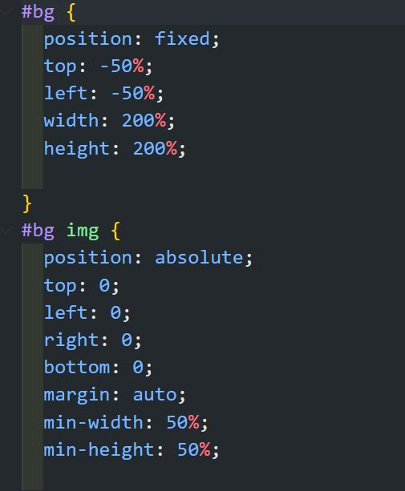

 
 

### Original Java Script Code:

#### Screenshot of models
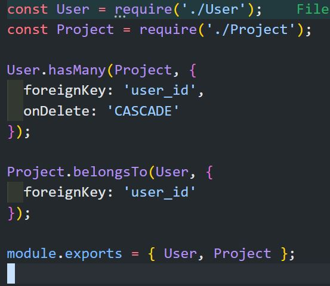
 
 

#### Screenshot of controllers
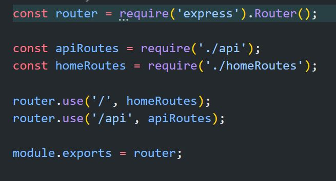
 
 

#### Screenshot of seeds
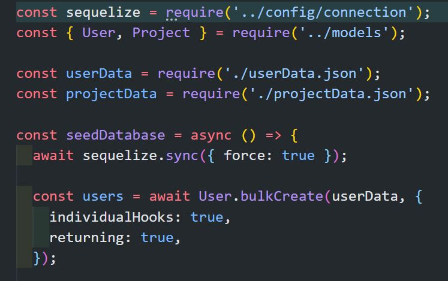

 
 

#### Screenshot of schema
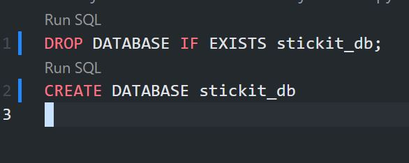

 
 

#### Screenshot of handlebars
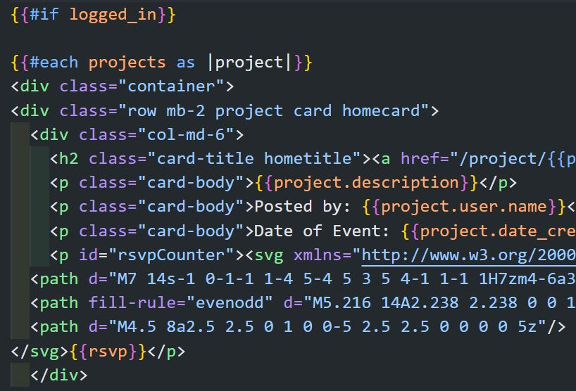

 
 

#### Screenshots of app 

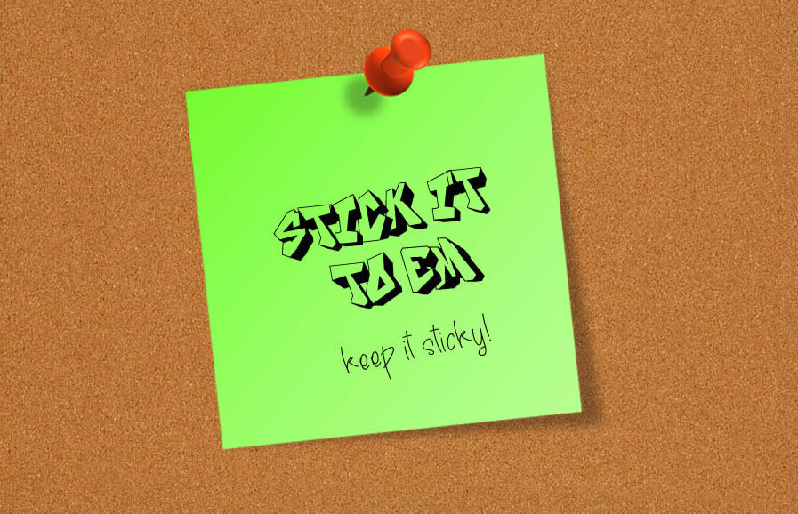
 
 

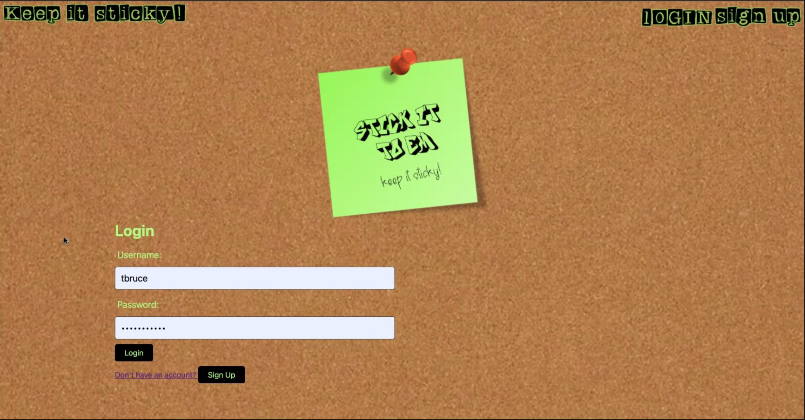
 
 

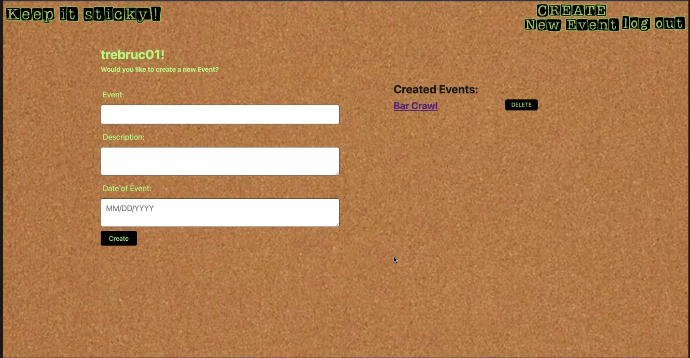
 
 

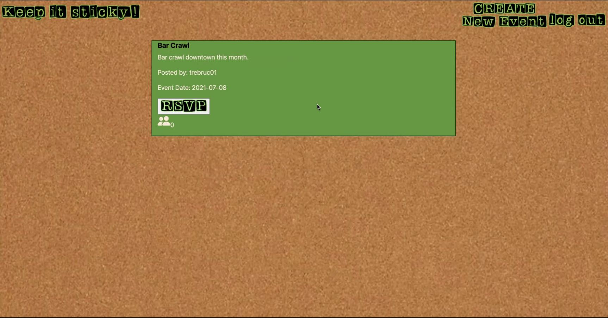
 
 

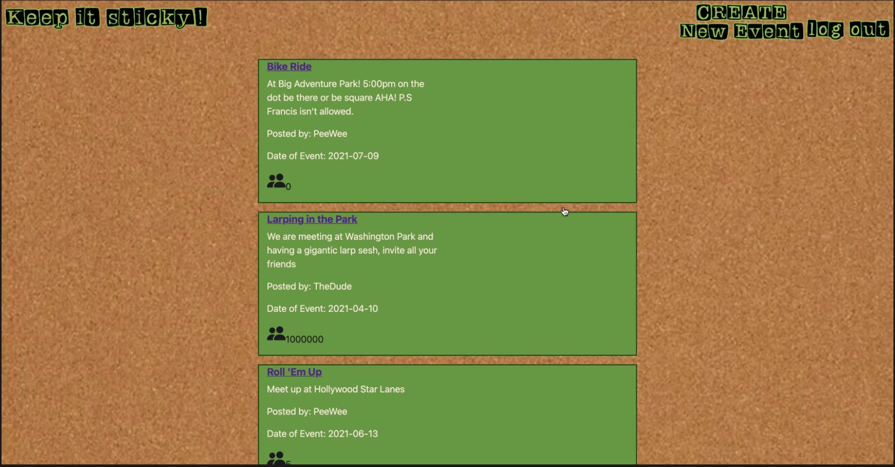
 
 

### Contributors
* Micah S.
* Ariel M.
* Trevor B.
* Eric D.
* Camden W.

